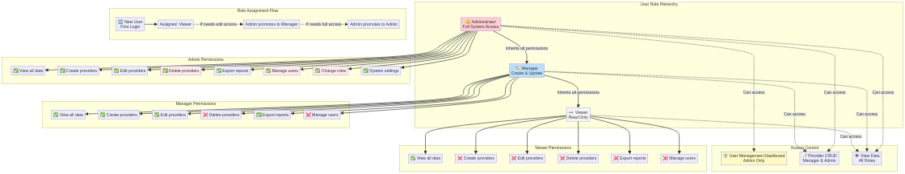
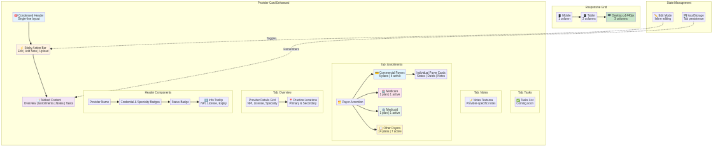
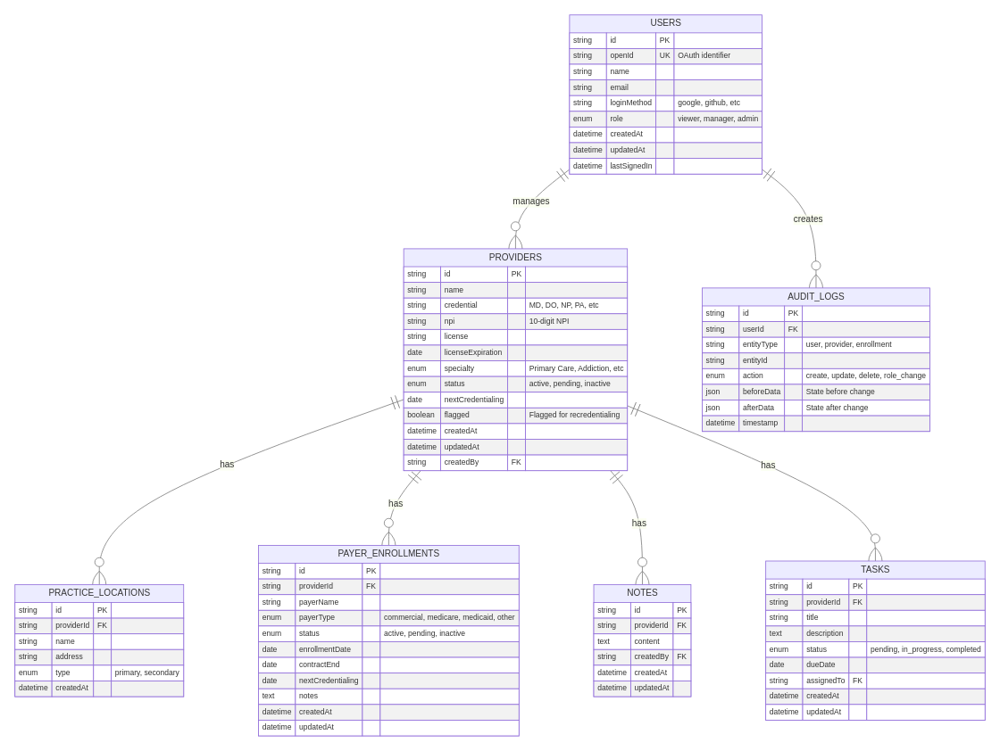
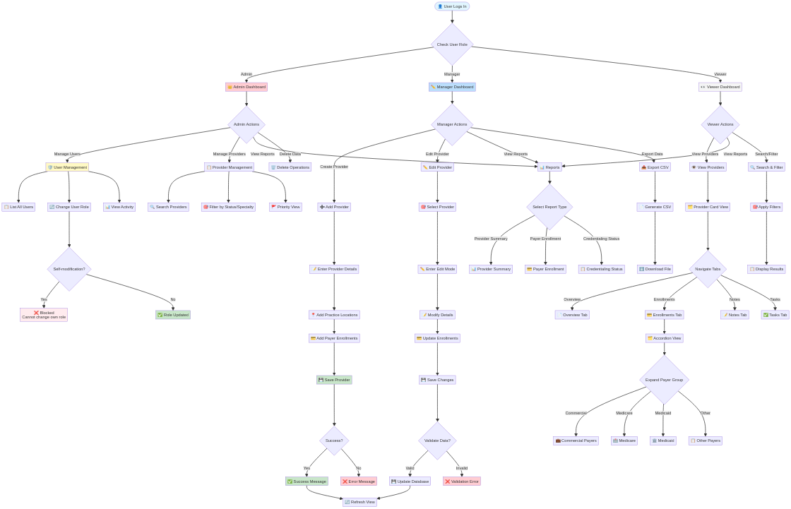

# MedEnroll Pro - System Architecture Documentation

**Version:** 2.0  
**Last Updated:** October 28, 2025  
**Status:** Production Ready

---

## Table of Contents

1. [Overview](#overview)
2. [System Components](#system-components)
3. [User Role Hierarchy](#user-role-hierarchy)
4. [Provider Card Architecture](#provider-card-architecture)
5. [Data Model](#data-model)
6. [System Workflow](#system-workflow)
7. [Technology Stack](#technology-stack)
8. [Security Architecture](#security-architecture)
9. [Performance Optimizations](#performance-optimizations)
10. [Future Enhancements](#future-enhancements)

---

## Overview

MedEnroll Pro is a comprehensive provider credentialing and enrollment management system designed for healthcare organizations. The system provides role-based access control, efficient provider data management, and streamlined payer enrollment tracking.

### Key Features

- **Role-Based Access Control** - Three-tier user hierarchy (Admin, Manager, Viewer)
- **Provider Management** - Complete CRUD operations for provider data
- **Payer Enrollment Tracking** - Organized by payer type with detailed enrollment information
- **Enhanced UX** - Condensed cards, tabbed interface, and grouped accordions
- **Real-Time Updates** - Instant data synchronization across all users
- **Export Capabilities** - CSV export for reporting and analysis

### Architecture Principles

1. **Separation of Concerns** - Clear boundaries between frontend, backend, and data layers
2. **Type Safety** - Full TypeScript implementation for compile-time error detection
3. **Component Reusability** - Modular UI components built with shadcn/ui
4. **Security First** - Role-based access control enforced at API level
5. **Performance** - Optimized rendering with React hooks and memoization

---

## System Components

### Frontend Architecture

**Technology:** React 18 + TypeScript + Vite

**Key Libraries:**
- **UI Framework:** shadcn/ui (Radix UI + Tailwind CSS)
- **State Management:** React Context API
- **API Client:** tRPC client with React Query
- **Routing:** React Router v6
- **Forms:** React Hook Form + Zod validation

**Component Structure:**
```
client/src/
├── components/          # Reusable UI components
│   ├── ui/             # Base UI components (shadcn/ui)
│   ├── ProviderCard.tsx
│   ├── ProviderCardEnhanced.tsx
│   ├── DashboardLayout.tsx
│   └── AddProviderDialog.tsx
├── pages/              # Page components
│   ├── Home.tsx
│   ├── Reports.tsx
│   ├── Settings.tsx
│   └── UserManagement.tsx
├── contexts/           # React contexts
│   └── ProviderContext.tsx
└── types/              # TypeScript type definitions
    └── provider.ts
```

### Backend Architecture

**Technology:** Node.js + Express + tRPC

**Key Libraries:**
- **API Framework:** tRPC for type-safe APIs
- **Database ORM:** Drizzle ORM
- **Authentication:** OAuth 2.0 (Google, GitHub)
- **Validation:** Zod schemas
- **Database:** TiDB (MySQL-compatible)

**API Structure:**
```
server/
├── routers/            # tRPC routers
│   ├── providerRouter.ts
│   ├── userRouter.ts
│   └── index.ts
├── _core/              # Core utilities
│   ├── auth.ts        # Authentication & authorization
│   └── db.ts          # Database connection
└── drizzle/            # Database schema
    └── schema.ts
```

---

## User Role Hierarchy



### Role Definitions

#### 👑 Administrator (Admin)

**Access Level:** Full system access

**Permissions:**
- ✅ View all providers and enrollments
- ✅ Create new providers
- ✅ Edit provider information
- ✅ Delete providers
- ✅ Export reports to CSV
- ✅ Manage user accounts
- ✅ Change user roles
- ✅ Access system settings

**Use Cases:**
- System administrators
- Practice managers
- IT staff
- Account owners

**Badge Color:** Red

---

#### ✏️ Manager

**Access Level:** Create and update

**Permissions:**
- ✅ View all providers and enrollments
- ✅ Create new providers
- ✅ Edit provider information
- ❌ Delete providers (admin only)
- ✅ Export reports to CSV
- ❌ Manage user accounts (admin only)
- ❌ Change user roles (admin only)

**Use Cases:**
- Credentialing coordinators
- Provider enrollment specialists
- Team leads

**Badge Color:** Blue

---

#### 👀 Viewer

**Access Level:** Read-only

**Permissions:**
- ✅ View all providers and enrollments
- ❌ Create providers
- ❌ Edit provider information
- ❌ Delete providers
- ❌ Export reports (manager/admin only)
- ❌ Manage user accounts (admin only)

**Use Cases:**
- Staff who need to view provider information
- Auditors and compliance reviewers
- Read-only stakeholders

**Badge Color:** Gray

---

### Role Inheritance

The role hierarchy follows a **privilege inheritance model**:

```
Admin (highest)
  ↓ inherits all permissions
Manager
  ↓ inherits all permissions
Viewer (lowest)
```

This means:
- Admins can do everything Managers and Viewers can do, plus admin-specific actions
- Managers can do everything Viewers can do, plus create/edit operations
- Viewers have the base set of read-only permissions

### Role Assignment Flow

1. **New User Registration** → Automatically assigned **Viewer** role
2. **Promotion to Manager** → Admin changes role via User Management Dashboard
3. **Promotion to Admin** → Admin changes role via User Management Dashboard
4. **Self-Modification Protection** → Users cannot change their own role

---

## Provider Card Architecture



### Design Goals

The enhanced provider card was redesigned to address key UX pain points:

1. **Reduce Vertical Space** - Condensed header saves ~40% vertical space
2. **Improve Information Hierarchy** - Most important info visible first
3. **Reduce Scrolling** - Grouped accordions eliminate long payer lists
4. **Context Preservation** - Sticky action bar keeps controls accessible
5. **Workflow Efficiency** - Tab persistence remembers user preferences

### Component Breakdown

#### 1. Condensed Header

**Layout:** Single horizontal line

**Components:**
- Provider name (bold, truncated if long)
- Credential badge (MD, DO, NP, PA, etc.)
- Specialty badge (Primary Care, Addiction, etc.)
- Status badge (Active, Pending, Inactive)
- Flagged badge (if applicable)
- Info tooltip (hover for NPI, license, expiry)

**Benefits:**
- Reduces header height from ~80px to ~48px
- All key identifiers visible at a glance
- Secondary details accessible via tooltip

---

#### 2. Sticky Action Bar

**Position:** Fixed beneath header, scrolls with content

**Actions:**
- **Edit Provider** - Enter edit mode for provider details
- **Add Note** - Quick note entry (future enhancement)
- **Upload Doc** - Document upload (future enhancement)
- **Credentialing Countdown** - Days until next credentialing (right side)

**Benefits:**
- Actions always accessible, no scrolling to top
- Visual feedback for credentialing urgency (red if overdue)
- Consistent placement across all cards

---

#### 3. Tabbed Content Layout

**Tabs:**
1. **Overview** - Provider details and practice locations
2. **Enrollments** - Payer enrollments with grouped accordion
3. **Notes** - Provider-specific notes
4. **Tasks** - Credentialing tasks (coming soon)

**Tab Persistence:**
- Last selected tab saved to `localStorage`
- Key format: `provider-{providerId}-tab`
- Restores tab on page reload or navigation

**Benefits:**
- Organizes content by workflow context
- Reduces cognitive load by showing one category at a time
- Remembers user preferences for efficiency

---

#### 4. Payer Enrollment Accordion

**Grouping Strategy:**

```
📋 Enrollments Tab
  ├── 💳 Commercial Payers (6 plans | 6 active)
  │   ├── BCBS BluePlus
  │   ├── Blue Cross Blue Shield
  │   ├── Humana
  │   ├── Aetna
  │   ├── United Healthcare
  │   └── Cigna
  ├── 🏥 Medicare (1 plan | 1 active)
  │   └── Medicare Part B
  ├── 🏛️ Medicaid (1 plan | 1 active)
  │   └── State Medicaid
  └── 📋 Other Payers (14 plans | 7 active)
      ├── Workers Comp
      ├── Auto Insurance
      └── ... (other payers)
```

**Accordion Headers Show:**
- Payer type icon
- Total plan count
- Active plan count
- Color-coded badges

**Individual Payer Cards Display:**
- Payer name
- Status badge (active, pending, inactive)
- Enrollment date
- Contract end date
- Next credentialing date
- Notes (if any)

**Benefits:**
- Eliminates need to scroll through 20+ payers
- Groups related payers for faster navigation
- Shows summary stats without expanding
- Supports multiple open accordions simultaneously

---

#### 5. Responsive Grid

**Breakpoints:**

| Screen Size | Columns | Example Devices |
|-------------|---------|-----------------|
| < 1024px (mobile) | 1 | Phones, small tablets |
| 1024px - 1439px (tablet/laptop) | 2 | Tablets, laptops |
| ≥ 1440px (desktop) | 3 | Large monitors, 4K displays |

**Implementation:**
```css
grid-cols-1 lg:grid-cols-2 2xl:grid-cols-3
```

**Benefits:**
- Maximizes screen real estate on large displays
- Maintains readability on smaller screens
- Reduces vertical scrolling by 33% on desktop

---

### State Management

#### Edit Mode

**Trigger:** Click "Edit Provider" button

**Changes:**
- Action bar shows "Save Changes" and "Cancel" buttons
- Provider details become editable inputs
- Payer enrollment fields become editable
- Notes textarea becomes editable

**Save Flow:**
1. User clicks "Save Changes"
2. Validation runs on all fields
3. If valid → API call to update provider
4. If invalid → Show validation errors
5. On success → Exit edit mode, show success message
6. On error → Stay in edit mode, show error message

#### Tab State

**Storage:** `localStorage`

**Key:** `provider-{providerId}-tab`

**Values:** `overview`, `enrollments`, `notes`, `tasks`

**Behavior:**
- On tab click → Save to localStorage
- On component mount → Read from localStorage
- If no saved tab → Default to `overview`

---

### Accessibility Features

**Keyboard Navigation:**
- Tab key navigates between interactive elements
- Arrow keys navigate within accordions
- Enter/Space activates buttons
- Escape closes expanded sections

**ARIA Attributes:**
- `aria-expanded` on accordion triggers
- `aria-label` on icon-only buttons
- `role="tablist"` on tab navigation
- `role="tabpanel"` on tab content

**Focus Management:**
- Visible focus outlines on all interactive elements
- Focus trap in dialogs
- Focus restoration after closing dialogs

**Screen Reader Support:**
- Semantic HTML structure
- Descriptive labels for all inputs
- Status announcements for async operations

---

## Data Model



### Entity Descriptions

#### USERS Table

**Purpose:** Store user accounts and authentication information

**Key Fields:**
- `openId` - Unique OAuth identifier (UK)
- `role` - User role (viewer, manager, admin)
- `lastSignedIn` - Track user activity

**Relationships:**
- One user can manage many providers
- One user can create many audit logs

**Indexes:**
- Primary key on `id`
- Unique index on `openId`
- Index on `role` for filtering

---

#### PROVIDERS Table

**Purpose:** Store healthcare provider information

**Key Fields:**
- `npi` - National Provider Identifier (10 digits)
- `license` - State license number
- `specialty` - Provider specialty
- `status` - Current status (active, pending, inactive)
- `flagged` - Flagged for recredentialing

**Relationships:**
- One provider has many practice locations
- One provider has many payer enrollments
- One provider has many notes
- One provider has many tasks

**Indexes:**
- Primary key on `id`
- Index on `npi` for lookups
- Index on `status` for filtering
- Index on `flagged` for priority view

---

#### PRACTICE_LOCATIONS Table

**Purpose:** Store provider practice locations

**Key Fields:**
- `type` - Location type (primary, secondary)
- `address` - Physical address

**Relationships:**
- Many locations belong to one provider

**Indexes:**
- Primary key on `id`
- Foreign key on `providerId`

---

#### PAYER_ENROLLMENTS Table

**Purpose:** Store payer enrollment information

**Key Fields:**
- `payerName` - Insurance payer name
- `payerType` - Payer category (commercial, medicare, medicaid, other)
- `status` - Enrollment status
- `enrollmentDate` - Date enrolled
- `contractEnd` - Contract expiration
- `nextCredentialing` - Next credentialing date
- `notes` - Enrollment notes

**Relationships:**
- Many enrollments belong to one provider

**Indexes:**
- Primary key on `id`
- Foreign key on `providerId`
- Index on `payerType` for grouping
- Index on `status` for filtering

---

#### NOTES Table

**Purpose:** Store provider-specific notes

**Key Fields:**
- `content` - Note text
- `createdBy` - User who created the note

**Relationships:**
- Many notes belong to one provider
- Many notes created by one user

**Indexes:**
- Primary key on `id`
- Foreign key on `providerId`
- Foreign key on `createdBy`

---

#### TASKS Table

**Purpose:** Store credentialing tasks (future enhancement)

**Key Fields:**
- `title` - Task title
- `status` - Task status (pending, in_progress, completed)
- `dueDate` - Task due date
- `assignedTo` - User assigned to task

**Relationships:**
- Many tasks belong to one provider
- Many tasks assigned to one user

**Indexes:**
- Primary key on `id`
- Foreign key on `providerId`
- Foreign key on `assignedTo`
- Index on `status` for filtering
- Index on `dueDate` for sorting

---

#### AUDIT_LOGS Table

**Purpose:** Track all data modifications (future enhancement)

**Key Fields:**
- `entityType` - Type of entity modified
- `entityId` - ID of modified entity
- `action` - Action performed (create, update, delete, role_change)
- `beforeData` - State before change (JSON)
- `afterData` - State after change (JSON)
- `timestamp` - When action occurred

**Relationships:**
- Many audit logs created by one user

**Indexes:**
- Primary key on `id`
- Foreign key on `userId`
- Index on `entityType` for filtering
- Index on `timestamp` for sorting

---

## System Workflow



### User Authentication Flow

1. User navigates to application
2. Clicks "Sign In" button
3. Redirected to OAuth provider (Google, GitHub, etc.)
4. User authorizes application
5. OAuth provider redirects back with token
6. Backend validates token and creates/updates user record
7. User assigned role (new users → Viewer)
8. Session established, user redirected to dashboard

### Provider Management Workflow

#### Creating a Provider (Manager/Admin)

1. Click "Add Provider" button
2. Fill in required fields:
   - Name
   - Credential (MD, DO, NP, PA, etc.)
   - NPI (10 digits)
   - License number
   - License expiration date
   - Specialty
3. Add practice locations:
   - Location name
   - Address
   - Type (primary/secondary)
4. Add payer enrollments:
   - Select payer
   - Enter enrollment date
   - Enter contract end date
   - Add notes if needed
5. Click "Save"
6. Validation runs
7. If valid → Provider created, success message shown
8. If invalid → Validation errors shown, user corrects

#### Editing a Provider (Manager/Admin)

1. Find provider card in dashboard
2. Click "Edit Provider" button
3. Card enters edit mode
4. Modify any fields as needed
5. Update payer enrollments
6. Click "Save Changes"
7. Validation runs
8. If valid → Provider updated, success message shown
9. If invalid → Validation errors shown, user corrects

#### Viewing Providers (All Roles)

1. Navigate to Providers page
2. View statistics cards (total, active, pending, inactive, flagged)
3. Use search to find specific providers
4. Use filters to narrow results:
   - Status filter (all, active, pending, inactive)
   - Specialty filter (all, addiction, primary care, etc.)
5. Toggle Priority View to see only flagged providers
6. Click on provider card to view details
7. Navigate tabs to see different information:
   - Overview → Provider details and locations
   - Enrollments → Payer enrollments by type
   - Notes → Provider-specific notes
   - Tasks → Credentialing tasks

### User Management Workflow (Admin Only)

#### Viewing Users

1. Click "Users" in sidebar (admin-only menu item)
2. View user statistics (total, admins, managers, viewers)
3. See list of all users with:
   - Name and email
   - Current role
   - Last sign-in time
   - Account creation date

#### Changing User Roles

1. Find user in list (use search if needed)
2. Locate "Actions" column
3. Click role dropdown
4. Select new role (Viewer, Manager, or Admin)
5. Role updated immediately
6. Success message shown
7. User's permissions updated in real-time

**Restrictions:**
- Cannot change own role (blocked for security)
- Only admins can access User Management
- All role changes should be logged (future: audit trail)

### Reporting Workflow

#### Viewing Reports (All Roles)

1. Click "Reports" in sidebar
2. Select report type:
   - Provider Summary Report
   - Payer Enrollment Report
   - Credentialing Status Report
3. View report data on screen

#### Exporting Reports (Manager/Admin)

1. Navigate to Reports page
2. Select report type
3. Click "Export to CSV" button
4. File downloads to browser
5. Open in Excel, Google Sheets, or other spreadsheet software

---

## Technology Stack

### Frontend

| Technology | Version | Purpose |
|------------|---------|---------|
| React | 18.x | UI framework |
| TypeScript | 5.x | Type safety |
| Vite | 5.x | Build tool |
| Tailwind CSS | 3.x | Styling |
| shadcn/ui | Latest | UI components |
| React Router | 6.x | Routing |
| tRPC Client | 10.x | API client |
| React Query | 5.x | Data fetching |
| Zod | 3.x | Validation |

### Backend

| Technology | Version | Purpose |
|------------|---------|---------|
| Node.js | 22.x | Runtime |
| Express | 4.x | Web server |
| tRPC | 10.x | API framework |
| Drizzle ORM | Latest | Database ORM |
| Zod | 3.x | Validation |
| JWT | 9.x | Authentication |

### Database

| Technology | Version | Purpose |
|------------|---------|---------|
| TiDB | Latest | Primary database |
| MySQL | 8.x compatible | SQL dialect |

### Development Tools

| Tool | Purpose |
|------|---------|
| ESLint | Code linting |
| Prettier | Code formatting |
| TypeScript | Type checking |
| Vite | Dev server |
| pnpm | Package management |

---

## Security Architecture

### Authentication

**Method:** OAuth 2.0

**Supported Providers:**
- Google
- GitHub
- (Extensible to other OAuth providers)

**Flow:**
1. User initiates login
2. Redirected to OAuth provider
3. User authorizes application
4. Provider returns authorization code
5. Backend exchanges code for access token
6. Backend validates token with provider
7. Backend creates/updates user record
8. Backend issues JWT session token
9. Client stores JWT in memory (not localStorage for security)

### Authorization

**Method:** Role-Based Access Control (RBAC)

**Enforcement Points:**
1. **Frontend** - UI elements hidden based on role
2. **API** - All endpoints check user role
3. **Database** - Row-level security (future enhancement)

**Middleware:**
```typescript
requireRole('admin') // Only admins can access
requireRole('manager') // Managers and admins can access
requireRole('viewer') // All authenticated users can access
```

### Data Protection

**In Transit:**
- All API calls over HTTPS
- TLS 1.3 encryption
- Secure WebSocket connections

**At Rest:**
- Database encryption enabled
- Sensitive fields encrypted (future: SSN, DOB)
- Regular automated backups

**Access Control:**
- JWT tokens expire after 24 hours
- Refresh tokens expire after 30 days
- Session invalidation on logout
- CORS restrictions enforced

### Security Best Practices

1. **Input Validation** - All inputs validated with Zod schemas
2. **SQL Injection Prevention** - Parameterized queries via Drizzle ORM
3. **XSS Prevention** - React auto-escapes output
4. **CSRF Protection** - SameSite cookies, CSRF tokens
5. **Rate Limiting** - API rate limits enforced
6. **Audit Logging** - All sensitive actions logged (future)

---

## Performance Optimizations

### Frontend Optimizations

**1. Code Splitting**
- Route-based code splitting with React.lazy()
- Component lazy loading for heavy components
- Dynamic imports for large libraries

**2. Memoization**
- useMemo for expensive computations
- useCallback for stable function references
- React.memo for pure components

**3. Virtual Scrolling**
- Planned for large payer lists (100+ enrollments)
- Renders only visible items
- Reduces DOM nodes by 90%

**4. Image Optimization**
- WebP format for images
- Lazy loading for below-fold images
- Responsive images with srcset

**5. Bundle Optimization**
- Tree shaking to remove unused code
- Minification and compression
- Brotli compression for assets

### Backend Optimizations

**1. Database Queries**
- Indexed columns for fast lookups
- Eager loading for related data
- Query result caching (Redis, future)

**2. API Response Caching**
- Cache provider lists (5 minute TTL)
- Cache user lists (1 minute TTL)
- Invalidate cache on updates

**3. Connection Pooling**
- Database connection pool (10 connections)
- Reuse connections across requests
- Automatic connection recycling

**4. Compression**
- Gzip compression for API responses
- Reduces payload size by 70%

### Monitoring

**Metrics Tracked:**
- API response times
- Database query times
- Error rates
- User session duration
- Feature usage analytics

**Tools:**
- Built-in analytics (VITE_ANALYTICS_ENDPOINT)
- Custom event tracking
- Performance monitoring

---

## Future Enhancements

### Phase 1: Core Features (Q1 2026)

1. **Audit Logging**
   - Track all data modifications
   - Show before/after diffs
   - Compliance reporting

2. **Protected Field Masking**
   - Encrypt sensitive data (SSN, DOB)
   - Mask fields in UI
   - Decrypt only when authorized

3. **Multi-Factor Authentication**
   - TOTP (Time-based One-Time Password)
   - SMS verification
   - Backup codes

4. **User Deactivation**
   - Soft delete user accounts
   - Preserve audit trail
   - Reactivation workflow

### Phase 2: Advanced Features (Q2 2026)

1. **Document Management**
   - Upload provider documents
   - Version control
   - Expiration tracking
   - S3 storage integration

2. **Task Management**
   - Create credentialing tasks
   - Assign to users
   - Due date reminders
   - Task completion tracking

3. **Notifications**
   - Email notifications
   - In-app notifications
   - Configurable notification preferences
   - Credential expiration alerts

4. **Advanced Reporting**
   - Custom report builder
   - Scheduled reports
   - Dashboard widgets
   - Data visualization

### Phase 3: Enterprise Features (Q3 2026)

1. **Multi-Organization Support**
   - Separate data per organization
   - Cross-organization user access
   - Organization-level settings

2. **API Access**
   - Public API for integrations
   - API key management
   - Rate limiting per key
   - Webhook support

3. **Advanced Search**
   - Full-text search
   - Saved searches
   - Search history
   - Advanced filters

4. **Bulk Operations**
   - Bulk provider import (CSV)
   - Bulk role assignment
   - Bulk status updates
   - Bulk export

### Phase 4: AI Features (Q4 2026)

1. **Smart Credentialing**
   - AI-powered credential verification
   - Automatic expiration prediction
   - Anomaly detection

2. **Intelligent Recommendations**
   - Suggest payer enrollments
   - Recommend credentialing dates
   - Flag potential issues

3. **Natural Language Search**
   - Search providers by natural language
   - "Show me all primary care providers in Minnesota"
   - Voice search support

---

## Appendix

### Glossary

**Credentialing** - The process of verifying and assessing the qualifications of healthcare providers

**Enrollment** - The process of registering a provider with an insurance payer

**NPI** - National Provider Identifier, a unique 10-digit identification number for healthcare providers

**Payer** - An insurance company or organization that pays for healthcare services

**tRPC** - TypeScript Remote Procedure Call, a framework for building type-safe APIs

**Drizzle ORM** - A TypeScript ORM for SQL databases

**shadcn/ui** - A collection of re-usable components built with Radix UI and Tailwind CSS

### References

- [React Documentation](https://react.dev)
- [TypeScript Documentation](https://www.typescriptlang.org/docs/)
- [tRPC Documentation](https://trpc.io/docs)
- [Drizzle ORM Documentation](https://orm.drizzle.team)
- [shadcn/ui Documentation](https://ui.shadcn.com)
- [Tailwind CSS Documentation](https://tailwindcss.com/docs)

### Contact

For questions or support:
- **Email:** support@medenrollpro.com
- **Feedback:** https://help.manus.im
- **Documentation:** This file and related guides in `/docs`

---

**Document Version:** 2.0  
**Last Updated:** October 28, 2025  
**Next Review:** January 28, 2026

